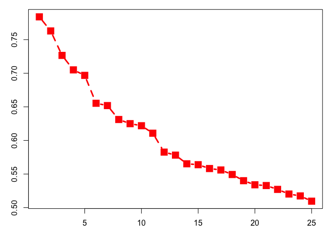
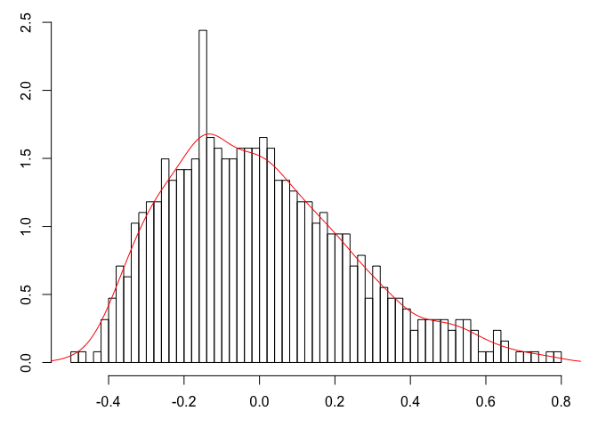
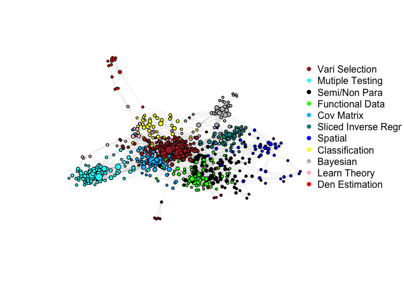
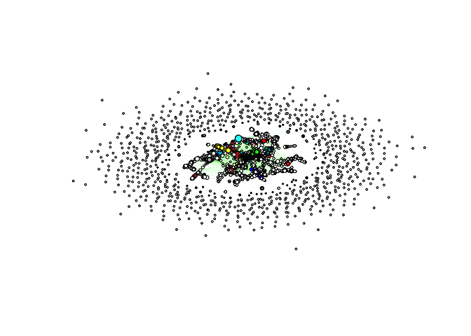
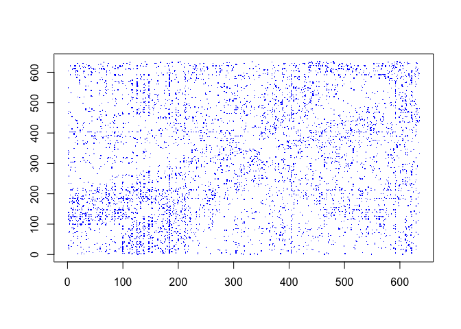
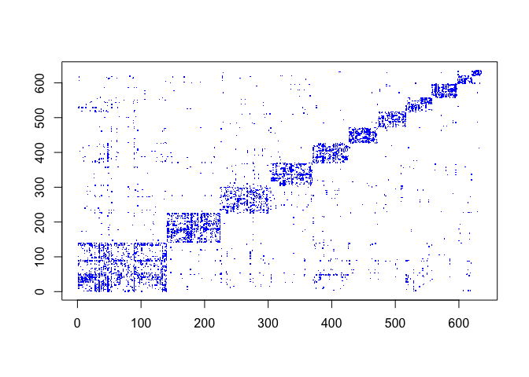

Code for "Don't Mind the (Eigen) Gap" -- Analysis on a Statistics Citation Network
================
Song Wang, Karl Rohe
July 20, 2016

This is the R code to reprocdue the results in the comment by Song Wang and Karl Rohe titled [Don't Mind the (Eigen) Gap](http://imstat.org/aoas/next_issue.html), which is an invited comment on the paper titled [Coauthorship and Citation Networks for Statisticians](http://imstat.org/aoas/next_issue.html) by Ji And Jin, to appear in the Annals of Applied Statistics. This discussion paper was also presented by Karl Rohe at JSM 2016.

The networks data are collected by the original authors Ji and Jin. We used web crowling skills to download the abstracts and keywords for each paper based on their DOI number. We then cleaned the text data and used them to help interpret the clusters given by clustering algorithms.

``` r
# Load the data and required packages
rm(list=ls())
load("../Data/data.RData")    #set the working directory
# authorList: a
# paperList: p
# paper-paper citation: p2p
# author-paper: a2p
# abstract + keywords: absKey

library(igraph)  # graph visualization
```

    ## 
    ## Attaching package: 'igraph'

    ## The following objects are masked from 'package:stats':
    ## 
    ##     decompose, spectrum

    ## The following object is masked from 'package:base':
    ## 
    ##     union

``` r
library(tm) # text mining
```

    ## Loading required package: NLP

``` r
library(Matrix)  ## sparse matrix computation
library(rARPACK)  ## fast eigenvector computation
library(irlba)   ## fast svd computation
library(xtable) #generate table in latex code
```

Focusing on raph with core &gt; 3. Many networks have core-perpery structures. It is most interesting to look at the core part of the graph.
--------------------------------------------------------------------------------------------------------------------------------------------

``` r
g = graph.adjacency(adjmatrix = p2p,mode = "undire")
#A <- get.adjacency(g)
V(g)$name = 1:length(V(g))
core = coreness(g,mode = "all")
coreID4 <- which( core >= 4 )
g2 = induced_subgraph(g, coreID4)
A = get.adjacency(g2)
```

Text analysis to create bag of words matrix: removed infrequent words, stopwords, numbers, punctuations, and combined some words of plural form and verbs etc.
--------------------------------------------------------------------------------------------------------------------------------------------------------------

``` r
#text <- absKey[,3]   # use all the document to create the dictionary
text <- absKey[coreID4,3]  # use specific set 

vc <- VCorpus( VectorSource(text) ) # just change the vector of strings to corpus, add some meta data. 
ctrl <- list(removePunctuation = list(preserve_intra_word_dashes = TRUE)
             , stopwords = TRUE
             ,removeNumbers = TRUE
             #, stemming = TRUE                    # remove prefix or postfix
             #, bounds = list(global= c(15,Inf))   # remove low-frequency/ high frequency words
             #, wordLengths = c(4, 20) # remove short words like 'a' 
             #, weighting = function(x) weightSMART(x, spec = "nnn")
)
Btmp <- TermDocumentMatrix(vc, control =  ctrl)  ## 
terms <- Btmp$dimnames$Terms
cat( "after initial cleaning: number of words and documents:" ,dim(Btmp), '\n')   
```

    ## after initial cleaning: number of words and documents: 6304 635

``` r
B = spMatrix(i = Btmp$i, j = Btmp$j, x = Btmp$v, nrow = Btmp$nrow, ncol  = Btmp$ncol)         # frequency count
rownames(B)  = Btmp$dimnames$Terms

######remove 's' 
# for word ends with 's', whether the word without 's' is in terms. 
# like designs is in, check the posiition of design, all the locations of design alike are returned
# some are NA, means like "boss" exists, but "bos" not.
idx <- match( gsub(pattern = '(.*)s$', replacement = '\\1', x= terms[grep('s$',terms)]), terms)
idx1 <- match(paste0(terms[idx[!is.na(idx)]],'s'),terms)    # location of plural terms
idx2 <- match(terms[idx[!is.na(idx)]], terms)   #location of single terms with out s
B[idx1,] <- B[idx1,]+B[idx2,]
terms <- terms[-idx1];  B<- B[terms,]; #update terms, Btmp

#######remvoe 'ed'
idx <- match( gsub(pattern = '(.*)ed$', replacement = '\\1', x= terms[grep('ed$',terms)]), terms)
idx1 <- match(paste0(terms[idx[!is.na(idx)]],'ed'),terms)
idx2 <- match(terms[idx[!is.na(idx)]], terms)
B[idx1,] <- B[idx1,]+B[idx2,]
terms <- terms[-idx1];  B<- B[terms,]; #update terms, Btmp
cat( "after initial cleaning + remov 's', 'ed': number of words and documents:"   ,dim(B), '\n')     
```

    ## after initial cleaning + remov 's', 'ed': number of words and documents: 5529 635

``` r
B = (B>0)+0
rownames(B)  = terms
kw = B
kw = kw[rowSums(kw)>=10,]   # remove words with appearance less than 10
print(dim(kw))
```

    ## [1] 793 635

``` r
kw = t(kw)
kw = sqrt(kw) # variance stabilizing transformation.
```

Regularized spectral clustering: How many clusters? Normally, people look at screept plot of the regularized or wighted adjcency matrice to find the place with a big eigen gap.
--------------------------------------------------------------------------------------------------------------------------------------------------------------------------------

``` r
nr = nrow(A); nc = ncol(A)
rs=rowSums(A); cs = colSums(A)
E = sum(A)
tau = sqrt(E/nr)  

Drow = Diagonal(n = nr, x = 1/sqrt(rs + tau))
Dcol = Diagonal(n = nc, x = 1/sqrt(cs + tau))
tmp = Drow%*%A
L = tmp %*% Dcol
e = irlba(L,nu = 50)

## Fig 1, Scree plot of top 25 eigenvalues of weighted adjacency matrix.
#par(mfcol = c(1,1), mar = c(5,4,4,2)+0.1)
#pdf('../latex/imsart-ims/screeplot.pdf',width = 5,height = 5)
par(mfcol = c(1,1),mar=c(3,3,1,1))
plot(1:25,e$d[1:25], cex=2, pch=15, type="b", lty=2, 
     lwd=3, col="red", bg="red", xlab="", ylab="")
```



``` r
#dev.off()

e1 = eigen(L,symmetric = TRUE)
#pdf('../latex/imsart-ims/histogram.pdf',width = 5,height = 5)
par(mfcol = c(1,1),mar=c(3,3,1,1))
hist(e1$values,breaks = 50, main ="",xlab = "", ylab="", probability = T)
lines(density(e1$values, bw =0.05),col="red")
```



``` r
#dev.off()
```

When there are 11 clusters, which is the biggest number of clusters suggested by the scree plot, the clustering results are pretty reasonable based on our interpretion from the text analysis. So are the cases when K = 2, 5, 7.
----------------------------------------------------------------------------------------------------------------------------------------------------------------------------------------------------------------------------------

``` r
nclust <- 11 
#nclust <- 20
X <- e$u[,1:nclust]
nX= t(apply(X, 1, function(x,nr) return(x/sqrt(sum(x^2)+length(x)/(100*nr))), nr = nr))
set.seed(10)
km_11 <- kmeans(nX,nclust,iter.max = 1000, nstart = 1000)
clust <- km_11$cluster
sort(table(clust))  
```

    ## clust
    ##   1   5   8   2   4   9  10   3  11   7   6 
    ##  15  23  40  41  44  46  57  65  80  84 140

``` r
# moving to interpret clusters, 

#table 1 
hv <- Matrix(0,nrow(nX), nclust)
for(i in 1:nclust) {hv[clust==i,i] <- 1}
ord <- order(km_11$size,decreasing = T)
hv <- hv[,ord]
vol_clust <- t(hv)%*%A%*%hv
cat("count of edges within and cross clusters:","\n")
```

    ## count of edges within and cross clusters:

``` r
print(vol_clust) 
```

    ## 11 x 11 sparse Matrix of class "dgCMatrix"
    ##                                                  
    ##  [1,] 1350  26  54  18  83  19  11  53   8  15  .
    ##  [2,]   26 788   5   4  12   1   .   2   1   6  .
    ##  [3,]   54   5 426  25  14   7  15   6   2   7  1
    ##  [4,]   18   4  25 446   6   2   4   2  10   4  .
    ##  [5,]   83  12  14   6 372   1   2   3   .   .  2
    ##  [6,]   19   1   7   2   1 340   2   1   1   .  .
    ##  [7,]   11   .  15   4   2   2 222   .   6   .  1
    ##  [8,]   53   2   6   2   3   1   . 220   .   1  .
    ##  [9,]    8   1   2  10   .   1   6   . 290   .  1
    ## [10,]   15   6   7   4   .   .   .   1   . 114  3
    ## [11,]    .   .   1   .   2   .   1   .   1   3 64

``` r
cat("count of edges in and outside its own block:","\n")
```

    ## count of edges in and outside its own block:

``` r
print(cbind(diag(vol_clust),rowSums(vol_clust)-diag(vol_clust)))
```

    ##       [,1] [,2]
    ##  [1,] 1350  287
    ##  [2,]  788   57
    ##  [3,]  426  136
    ##  [4,]  446   75
    ##  [5,]  372  123
    ##  [6,]  340   34
    ##  [7,]  222   41
    ##  [8,]  220   68
    ##  [9,]  290   29
    ## [10,]  114   36
    ## [11,]   64    8

``` r
#library(wordcloud)
bestWords = matrix("", nrow = nclust, ncol = 20)
#pdf('../latex/imsart-ims/bestWords.pdf', width = 3.5, height =3.5)
for(i in 1:nclust){
    clust_i = which(hv[,i]==1)
    #vals = sqrt(colMeans(kw[clust_i,])) - sqrt(colMeans(kw[-clust_i,]))
    vals =  asin(sqrt(colMeans(kw[clust_i,])))- asin(sqrt(colMeans(kw[-clust_i,])))
    bestWords[i,] = (names(vals)[order(-vals)[1:20]])
    #wordcloud( words= names(vals),freq = vals, min.freq  = sort(vals,decreasing = T)[20], random.order = F, rot.per = 0, scale = c(2,0.5))
}
#bestWords[,1:10]
#dev.off()


#Table 2
topwords <- apply(bestWords[,1:10], MARGIN = 1, function(x) paste0(x,collapse = ", "))
results <- list()
results$id = 1:nclust
name11 <- c("Vari Selection","Mutiple Testing", "Semi/Non Para", "Functional Data", 
                 "Cov Matrix",'Sliced Inverse Regr', "Spatial", "Classification",
                 "Bayesian","Learn Theory",'Den Estimation')
if(nclust == 11)  results$name <- name11
results$size <-  km_11$size[ord]
results$In <- as.integer(diag(vol_clust))
results$Out <- as.integer(rowSums(vol_clust)-diag(vol_clust))
results$topwords <- topwords                      
results <- data.frame(results,row.names = NULL)  
print( cbind(results[1:5,1:5],results[7:11,1:5]))
```

    ##   id            name size   In Out id           name size  In Out
    ## 1  1  Vari Selection  140 1350 287  7        Spatial   44 222  41
    ## 2  2 Mutiple Testing   84  788  57  8 Classification   41 220  68
    ## 3  3   Semi/Non Para   80  426 136  9       Bayesian   40 290  29
    ## 4  4 Functional Data   65  446  75 10   Learn Theory   23 114  36
    ## 5  5      Cov Matrix   57  372 123 11 Den Estimation   15  64   8

``` r
print( results[,c(2,6)] )
```

    ##                   name
    ## 1       Vari Selection
    ## 2      Mutiple Testing
    ## 3        Semi/Non Para
    ## 4      Functional Data
    ## 5           Cov Matrix
    ## 6  Sliced Inverse Regr
    ## 7              Spatial
    ## 8       Classification
    ## 9             Bayesian
    ## 10        Learn Theory
    ## 11      Den Estimation
    ##                                                                                                                   topwords
    ## 1                       lasso, selection, variable, penalty, oracle, regularization, select, linear, regression, algorithm
    ## 2                                    false, discovery, testing, hypotheses, rate, null, fdr, control, multiple, proportion
    ## 3  asymptotic, semiparametric, nonparametric, additive, quantile, backfitting, longitudinal, partially, efficiency, spline
    ## 4                       functional, principal, scalar, data, component, differential, function, approach, observed, random
    ## 5                                  matrix, covariance, matrices, graphical, definite, norm, precision, graph, ini, inverse
    ## 6                      reduction, dimension, sliced, inverse, central, subspace, regression, sufficient, response, average
    ## 7             spatial, computational, predictive, maximum, likelihood, quality, gaussian, covariance, process, approximate
    ## 8                       classification, learning, machine, minimization, risk, inequalities, binary, support, main, vector
    ## 9                          dirichlet, process, posterior, prior, computation, bayesian, chain, clustering, markov, mixture
    ## 10                          confidence, coverage, wavelet, construct, mean, lower, unknown, close, nonasymptotic, interest
    ## 11                  nonparametric, density, error, measurement, kernel, setting, observed, explanatory, measured, function

``` r
#latex code for table
# print(xtable(    cbind(results[1:5,1:5],results[7:11,1:5])    ))
# print(xtable(    results[,c(2,6)]    ))


## Fig 2

colours <- c("red","yellow","green","blue","pink",'brown',
             "cyan","grey","darkcyan", 'deepskyblue','black')
vColor <- character(vcount(g2))      
for( i in 1:11){
    vColor[which(km_11$cluster == i)] <- colours[i]
}
#pdf('../latex/imsart-ims/graph_visualization_11.pdf', width = 14, height = 10 )
set.seed(10)
plot(g2, vertex.color = vColor, 
     vertex.label = "",
     #vertex.label.cex=3, vertex.label.color='red', 
     #vertex.label.dist = 0,
     vertex.size=sqrt(degree(g2)),  asp=.7, 
     layout = layout.auto,    # same as fruchterman.reingold
     # equivalent to <100,layout.kamada.kawai,
     # layout.fruchterman.reingold, 
     # layout.drl
     edge.color='grey',edge.width = 0.25,  margin=c(0,0,0,0.5)
)
legend(x= c(1,1), y = c(1,1),legend = name11,  col = colours[ord], pch = 16, cex = 1)
```



``` r
#dev.off()
```

For K =20, the results are also interpretable. Our point is that we should reject the idea that there is one "right" answer to choose of the number of clusters. It is usually just an exploratory process.
-----------------------------------------------------------------------------------------------------------------------------------------------------------------------------------------------------------

``` r
nclust <- 20
#nclust <- 20
X <- e$u[,1:nclust]
nX= t(apply(X, 1, function(x,nr) return(x/sqrt(sum(x^2)+length(x)/(100*nr))), nr = nr))
set.seed(10)
km_20 <- kmeans(nX,nclust,iter.max = 1000, nstart = 1000)

hv <- Matrix(0,nrow(nX), nclust)
for(i in 1:nclust) { hv[km_20$cluster ==i,i] <- 1 }
ord <- order(km_20$size,decreasing = T)
hv <- hv[,ord]
cat("count of edges within and cross clusters:","\n")
```

    ## count of edges within and cross clusters:

``` r
vol_clust <- t(hv)%*%A%*%hv
print(vol_clust)
```

    ## 20 x 20 sparse Matrix of class "dgCMatrix"
    ##                                                                          
    ##  [1,] 754   3   2   9   .  17   .   .   .   .   9   .  .   1   6  .  .  .
    ##  [2,]   3 546   3  28  15 131  29  27   3   8  21   4  5   3   3 12  .  1
    ##  [3,]   2   3 364   6   2   6  19  11   7   4   5   1  2   1   5  .  .  .
    ##  [4,]   9  28   6 312   1  42  10   .   .   .  10   1  1   2   .  8  2  .
    ##  [5,]   .  15   2   1 336   2   3   3   .   1   .   .  2   1   .  1  .  .
    ##  [6,]  17 131   6  42   2 292   5   2   .   5   8   .  6  24   1  6  .  2
    ##  [7,]   .  29  19  10   3   5 202   3   .  18   .   . 10   .   2  .  .  2
    ##  [8,]   .  27  11   .   3   2   3 130   4   8   1   8  1   5   3  4  1  1
    ##  [9,]   .   3   7   .   .   .   .   4 252   .   3   5  1   .   .  1  .  .
    ## [10,]   .   8   4   .   1   5  18   8   . 124   .   2  2   .   2  .  .  .
    ## [11,]   9  21   5  10   .   8   .   1   3   . 130   .  .   1   3  5  .  .
    ## [12,]   .   4   1   1   .   .   .   8   5   2   . 130  .   .   .  .  .  2
    ## [13,]   .   5   2   1   2   6  10   1   1   2   .   . 94   3   .  .  .  .
    ## [14,]   1   3   1   2   1  24   .   5   .   .   1   .  3 112   1  2  .  .
    ## [15,]   6   3   5   .   .   1   2   3   .   2   3   .  .   1 104  .  3  .
    ## [16,]   .  12   .   8   1   6   .   4   1   .   5   .  .   2   . 64  .  .
    ## [17,]   .   .   .   2   .   .   .   1   .   .   .   .  .   .   3  . 62  .
    ## [18,]   .   1   .   .   .   2   2   1   .   .   .   2  .   .   .  .  . 46
    ## [19,]   .   4   .   1   .   .   .   .   3   .   .   .  .   .   .  .  .  .
    ## [20,]   1  10   .   1   1   5   1   2   .   .   .   .  1   .   .  1  .  1
    ##            
    ##  [1,]  .  1
    ##  [2,]  4 10
    ##  [3,]  .  .
    ##  [4,]  1  1
    ##  [5,]  .  1
    ##  [6,]  .  5
    ##  [7,]  .  1
    ##  [8,]  .  2
    ##  [9,]  3  .
    ## [10,]  .  .
    ## [11,]  .  .
    ## [12,]  .  .
    ## [13,]  .  1
    ## [14,]  .  .
    ## [15,]  .  .
    ## [16,]  .  1
    ## [17,]  .  .
    ## [18,]  .  1
    ## [19,] 42  .
    ## [20,]  . 36

``` r
cat("count of edges in and out its own cluster:","\n")
```

    ## count of edges in and out its own cluster:

``` r
print(cbind(diag(vol_clust),rowSums(vol_clust)-diag(vol_clust)))
```

    ##       [,1] [,2]
    ##  [1,]  754   48
    ##  [2,]  546  310
    ##  [3,]  364   74
    ##  [4,]  312  122
    ##  [5,]  336   32
    ##  [6,]  292  262
    ##  [7,]  202  102
    ##  [8,]  130   84
    ##  [9,]  252   27
    ## [10,]  124   50
    ## [11,]  130   66
    ## [12,]  130   23
    ## [13,]   94   34
    ## [14,]  112   44
    ## [15,]  104   29
    ## [16,]   64   40
    ## [17,]   62    6
    ## [18,]   46    9
    ## [19,]   42    8
    ## [20,]   36   24

``` r
bestWords = matrix("", nrow = nclust, ncol = 20)
#pdf('../latex/imsart-ims/bestWords.pdf', width = 3.5, height =3.5)
for(i in 1:nclust){
    clust_i = which(hv[,i]==1)
    #vals = sqrt(colMeans(kw[clust_i,])) - sqrt(colMeans(kw[-clust_i,]))
    vals =  asin(sqrt(colMeans(kw[clust_i,])))- asin(sqrt(colMeans(kw[-clust_i,])))
    bestWords[i,] = (names(vals)[order(-vals)[1:20]])
    #wordcloud( words= names(vals),freq = vals, min.freq  = sort(vals,decreasing = T)[20], random.order = F, rot.per = 0, scale = c(2,0.5))
}
#bestWords[,1:10]

topwords <- apply(bestWords[,1:10],MARGIN = 1, function(x) paste0(x,collapse = ", "))
results <- list()
results$id = 1:nclust
name20 <- c("Multiple Testing","Lasso I","FDA","Cov Esitmation",'Dim Reduction','Lasso II',"Longitudinal", "Forecast(in other fields)","Bayesian nonpara","Non-parametric I", "Bayes(others)",'Spatial(bayesian)','Quantile regreesion','Learning Theory I', 'Learning Theory II', 'Classification','Non-parametric II','Spatial II(frequentist)','Designs','Semiparametric')

if(nclust ==20) results$name <- name20
results$size <-  km_20$size[ord]
results$In <- as.integer(diag(vol_clust))
results$Out <- as.integer(rowSums(vol_clust)-diag(vol_clust))
results$topwords <- topwords                      
results <- data.frame(results,row.names = NULL)                     
head(results)
```

    ##   id             name size  In Out
    ## 1  1 Multiple Testing   77 754  48
    ## 2  2          Lasso I   62 546 310
    ## 3  3              FDA   51 364  74
    ## 4  4   Cov Esitmation   46 312 122
    ## 5  5    Dim Reduction   45 336  32
    ## 6  6         Lasso II   44 292 262
    ##                                                                                              topwords
    ## 1               false, discovery, testing, hypotheses, rate, null, fdr, control, multiple, proportion
    ## 2         selection, variable, lasso, oracle, penalty, algorithm, path, regularization, property, fan
    ## 3   functional, principal, scalar, observed, data, component, function, response, irregular, analysis
    ## 4    matrix, covariance, matrices, graphical, norm, definite, high-dimensional, sparsity, ini, sample
    ## 5 reduction, dimension, sliced, inverse, central, subspace, regression, sufficient, average, variance
    ## 6                 lasso, high-dimensional, ipi, sparse, larger, selection, nonzero, ini, much, number

``` r
#table 4
print( cbind(results[1:10,1:5],results[11:20,1:5]) )
```

    ##    id                      name size  In Out id                    name
    ## 1   1          Multiple Testing   77 754  48 11           Bayes(others)
    ## 2   2                   Lasso I   62 546 310 12       Spatial(bayesian)
    ## 3   3                       FDA   51 364  74 13     Quantile regreesion
    ## 4   4            Cov Esitmation   46 312 122 14       Learning Theory I
    ## 5   5             Dim Reduction   45 336  32 15      Learning Theory II
    ## 6   6                  Lasso II   44 292 262 16          Classification
    ## 7   7              Longitudinal   37 202 102 17       Non-parametric II
    ## 8   8 Forecast(in other fields)   36 130  84 18 Spatial II(frequentist)
    ## 9   9          Bayesian nonpara   32 252  27 19                 Designs
    ## 10 10          Non-parametric I   29 124  50 20          Semiparametric
    ##    size  In Out
    ## 1    29 130  66
    ## 2    23 130  23
    ## 3    23  94  34
    ## 4    20 112  44
    ## 5    20 104  29
    ## 6    15  64  40
    ## 7    14  62   6
    ## 8    11  46   9
    ## 9    11  42   8
    ## 10   10  36  24

``` r
print(   results[,c(2,6)] )
```

    ##                         name
    ## 1           Multiple Testing
    ## 2                    Lasso I
    ## 3                        FDA
    ## 4             Cov Esitmation
    ## 5              Dim Reduction
    ## 6                   Lasso II
    ## 7               Longitudinal
    ## 8  Forecast(in other fields)
    ## 9           Bayesian nonpara
    ## 10          Non-parametric I
    ## 11             Bayes(others)
    ## 12         Spatial(bayesian)
    ## 13       Quantile regreesion
    ## 14         Learning Theory I
    ## 15        Learning Theory II
    ## 16            Classification
    ## 17         Non-parametric II
    ## 18   Spatial II(frequentist)
    ## 19                   Designs
    ## 20            Semiparametric
    ##                                                                                                                 topwords
    ## 1                                  false, discovery, testing, hypotheses, rate, null, fdr, control, multiple, proportion
    ## 2                            selection, variable, lasso, oracle, penalty, algorithm, path, regularization, property, fan
    ## 3                      functional, principal, scalar, observed, data, component, function, response, irregular, analysis
    ## 4                       matrix, covariance, matrices, graphical, norm, definite, high-dimensional, sparsity, ini, sample
    ## 5                    reduction, dimension, sliced, inverse, central, subspace, regression, sufficient, average, variance
    ## 6                                    lasso, high-dimensional, ipi, sparse, larger, selection, nonzero, ini, much, number
    ## 7         longitudinal, semiparametric, asymptotic, working, data, correlation, profile, partially, estimator, normality
    ## 8  differential, article, statistical, dynamic, equation, ordinary, compared, modeling, classification, cross-validation
    ## 9                  dirichlet, process, posterior, prior, computation, chain, markov, mixture, distribution, hierarchical
    ## 10            additive, smoothing, spline, backfitting, smooth, penalized, generalized, fitting, nonparametric, converge
    ## 11                       bayesian, prior, posterior, mixture, scale, shrinkage, corresponding, uncertainty, bayes, white
    ## 12             spatial, gaussian, covariance, computational, process, maximum, markov, likelihood, quality, non-gaussian
    ## 13                             quantile, model, regression, resampling, future, rank, score, varying, empirical, without
    ## 14        minimization, risk, inequalities, classification, empirical, learning, penalized, convex, regularization, main
    ## 15                           confidence, coverage, mean, construct, unknown, lower, wavelet, whose, close, nonasymptotic
    ## 16                      data, analysis, classification, discriminant, population, size, low, microarray, high, principal
    ## 17                 nonparametric, error, measurement, kernel, setting, density, observed, explanatory, problem, measured
    ## 18                     spatial, marginal, dependence, likelihood, multivariate, limit, distance, complex, maximum, joint
    ## 19             orthogonal, constructing, frequentist, construction, empirical, likelihood, design, enjoy, seen, flexible
    ## 20              semiparametric, inference, parameter, nuisance, yield, maximum, likelihood, sampler, profile, consistent

``` r
#print(xtable(    cbind(results[1:10,1:5],results[11:20,1:5]) ))
#print(xtable(   results[,c(2,6)]  ))
```

Extra tables and visualization
------------------------------

``` r
# visualization for the core in the whole plot
#pdf("../latex/imsart-ims/graph_visualization_2.pdf", width =12,  height = 6)

Vcolor <- character(nrow(p2p))
Vcolor[] <-"white"
Vcolor[core>3] <- vColor
plot(g, vertex.color = Vcolor, vertex.label= "",
     vertex.label.cex=1.2,
     vertex.size=log(degree(g)+1), vertex.label.color='red', asp=.5,
     layout = layout.drl, #layout.kamada.kawai , #layout.fruchterman.reingold, #
     edge.color='green', edge.width = 0.1, margin=c(0,0,0,0)
)
```



``` r
#dev.off()


# plot of the sorted adjcency matrix
ord <- order(km_11$size, decreasing =  T)
ord_node <- NULL
for(i in ord){
    ord_node <- c(ord_node, which ( km_11$cluster==i))
}
idx <- which(as.matrix(A)==1,arr.ind = T)
#pdf('./A_plot.pdf',width = 4, height =4)
plot(idx[,1],idx[,2],col= "blue", pch =".", xlab="", ylab="")
```



``` r
#dev.off()
A.sort <- as.matrix(A)[ord_node,ord_node]
idx.sort <- which(A.sort ==1, arr.ind =  1)
#pdf('./sbm_plot.pdf',width = 4, height =4)
plot(idx.sort[,1],idx.sort[,2],col= "blue", pch =".",xlab="", ylab="")
```



``` r
#dev.off()
```

Individual memberships for the 635 papers in the core &gt;=4.
-------------------------------------------------------------

``` r
paper_core4 <- absKey[coreID4,]
dict <- data.frame(list(name = name11, number = order(km_11$size,decreasing = T)))
clust_name <- as.character( dict$name[order(dict$number)] )
paper_core4$clust11 <- km_11$cluster
for(i in 1:11){
    paper_core4$clust11[which(km_11$cluster==i)] <- clust_name[i]
} 

paper_core4$clust20 <- km_20$cluster
dict <- data.frame(list(name = name20, number = order(km_20$size,decreasing = T)))
clust_name <- as.character( dict$name[order(dict$number)] )
for (i in 1:20){
    paper_core4$clust20[which(km_20$cluster==i)] <- clust_name[i]
}
print(table(paper_core4[c(6,5)]))
```

    ##                            clust11
    ## clust20                     Bayesian Classification Cov Matrix
    ##   Bayes(others)                    1              0          4
    ##   Bayesian nonpara                32              0          0
    ##   Classification                   0              9          0
    ##   Cov Esitmation                   0              0         46
    ##   Designs                          5              0          0
    ##   Dim Reduction                    0              0          0
    ##   FDA                              0              0          0
    ##   Forecast(in other fields)        2              8          0
    ##   Lasso I                          0              0          0
    ##   Lasso II                         0              1          1
    ##   Learning Theory I                0             20          0
    ##   Learning Theory II               0              0          0
    ##   Longitudinal                     0              0          5
    ##   Multiple Testing                 0              0          0
    ##   Non-parametric I                 0              0          0
    ##   Non-parametric II                0              0          0
    ##   Quantile regreesion              0              3          0
    ##   Semiparametric                   0              0          1
    ##   Spatial II(frequentist)          0              0          0
    ##   Spatial(bayesian)                0              0          0
    ##                            clust11
    ## clust20                     Den Estimation Functional Data Learn Theory
    ##   Bayes(others)                          0               1            1
    ##   Bayesian nonpara                       0               0            0
    ##   Classification                         0               0            0
    ##   Cov Esitmation                         0               0            0
    ##   Designs                                0               0            0
    ##   Dim Reduction                          0               0            0
    ##   FDA                                    0              51            0
    ##   Forecast(in other fields)              1              10            3
    ##   Lasso I                                0               0            0
    ##   Lasso II                               0               0            0
    ##   Learning Theory I                      0               0            0
    ##   Learning Theory II                     0               1           19
    ##   Longitudinal                           0               2            0
    ##   Multiple Testing                       0               0            0
    ##   Non-parametric I                       0               0            0
    ##   Non-parametric II                     14               0            0
    ##   Quantile regreesion                    0               0            0
    ##   Semiparametric                         0               0            0
    ##   Spatial II(frequentist)                0               0            0
    ##   Spatial(bayesian)                      0               0            0
    ##                            clust11
    ## clust20                     Mutiple Testing Semi/Non Para
    ##   Bayes(others)                           5             0
    ##   Bayesian nonpara                        0             0
    ##   Classification                          0             0
    ##   Cov Esitmation                          0             0
    ##   Designs                                 0             0
    ##   Dim Reduction                           0             0
    ##   FDA                                     0             0
    ##   Forecast(in other fields)               0             1
    ##   Lasso I                                 0             1
    ##   Lasso II                                2             1
    ##   Learning Theory I                       0             0
    ##   Learning Theory II                      0             0
    ##   Longitudinal                            0            30
    ##   Multiple Testing                       77             0
    ##   Non-parametric I                        0            27
    ##   Non-parametric II                       0             0
    ##   Quantile regreesion                     0            19
    ##   Semiparametric                          0             1
    ##   Spatial II(frequentist)                 0             0
    ##   Spatial(bayesian)                       0             0
    ##                            clust11
    ## clust20                     Sliced Inverse Regr Spatial Vari Selection
    ##   Bayes(others)                               0       0             17
    ##   Bayesian nonpara                            0       0              0
    ##   Classification                              0       0              6
    ##   Cov Esitmation                              0       0              0
    ##   Designs                                     0       0              6
    ##   Dim Reduction                              45       0              0
    ##   FDA                                         0       0              0
    ##   Forecast(in other fields)                   1       8              2
    ##   Lasso I                                     0       0             61
    ##   Lasso II                                    0       0             39
    ##   Learning Theory I                           0       0              0
    ##   Learning Theory II                          0       0              0
    ##   Longitudinal                                0       0              0
    ##   Multiple Testing                            0       0              0
    ##   Non-parametric I                            0       2              0
    ##   Non-parametric II                           0       0              0
    ##   Quantile regreesion                         0       0              1
    ##   Semiparametric                              0       0              8
    ##   Spatial II(frequentist)                     0      11              0
    ##   Spatial(bayesian)                           0      23              0

``` r
#ten papers from the core, abstracts and its interpretation by clust11, clust20
print(paper_core4[1:10,4:6])
```

    ##                                                                                                                                                                  keywords
    ## 6                                                                                                          efficiency;empirical likelihood;high quantiles;prior;posterior
    ## 9                                                                                                 large-dimensional asymptotics;nonlinear shrinkage;rotation equivariance
    ## 13                                                                                    high-dimensional covariance;large small;likelihood ratio test;testing for gene-sets
    ## 16                     statistical learning;fast rates of convergence;oracle inequalities;regularization;classification;aggregation;model selection;high-dimensional data
    ## 17                                                                                   identifiability;projection;ridge regression;sparsity;thresholding;variable selection
    ## 21 autocovariance matrices;blessing of dimensionality;eigenanalysis;fast convergence rates;multivariate time series;ratio-based estimator;strength of factors;white noise
    ## 23                      aggregation;regression;classification;oracle inequalities;finite sample bounds;generalized linear models;logistic regression;minimax lower bounds
    ## 30                                                              covariance tapering;gaussian process;model selection;one-step sparse estimation;scad;spatial linear model
    ## 37                                                                                                  linear regression;model selection;functional regression;factor models
    ## 38                                                                                                              adaptive confidence sets;nonparametric hypothesis testing
    ##            clust11            clust20
    ## 6         Bayesian            Designs
    ## 9       Cov Matrix     Cov Esitmation
    ## 13      Cov Matrix     Cov Esitmation
    ## 16  Classification  Learning Theory I
    ## 17  Vari Selection            Lasso I
    ## 21      Cov Matrix     Cov Esitmation
    ## 23  Classification  Learning Theory I
    ## 30         Spatial  Spatial(bayesian)
    ## 37 Functional Data                FDA
    ## 38    Learn Theory Learning Theory II
